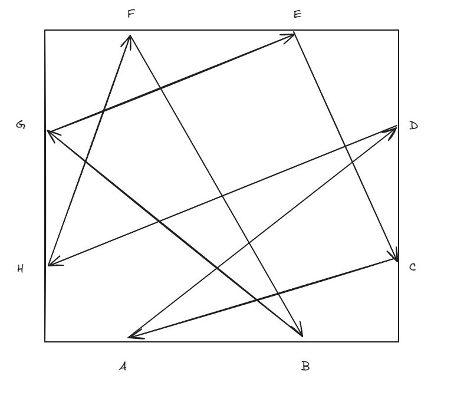
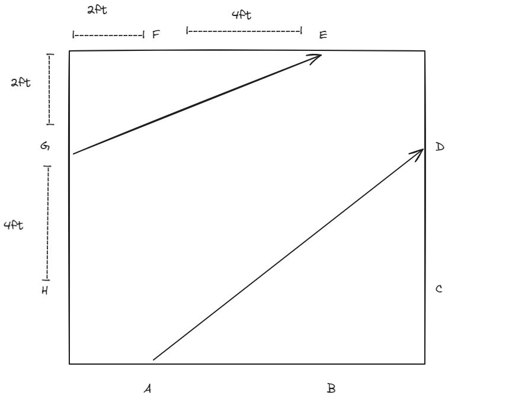
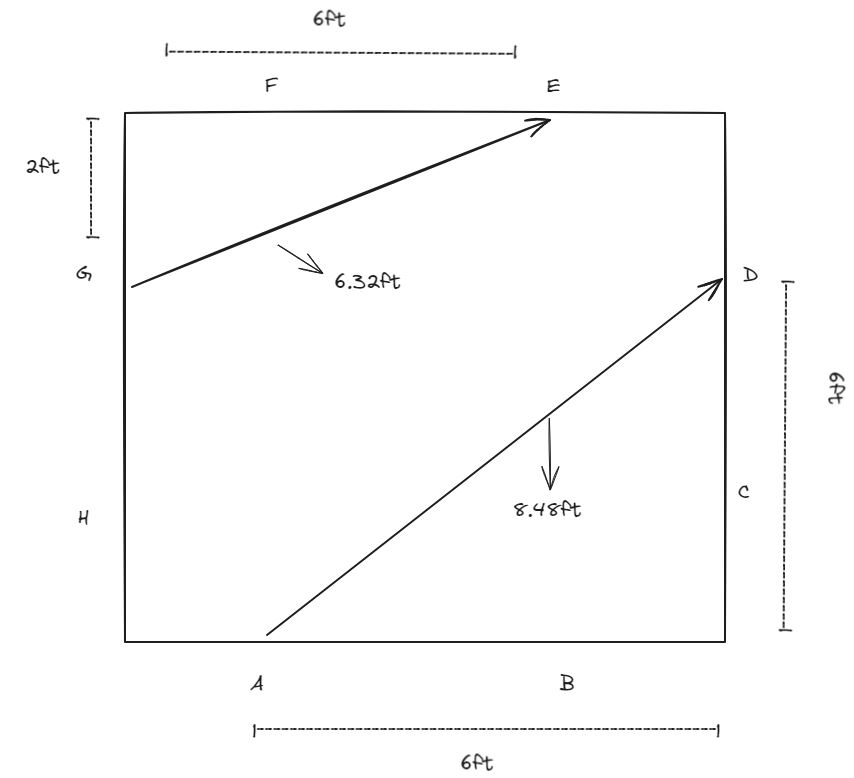
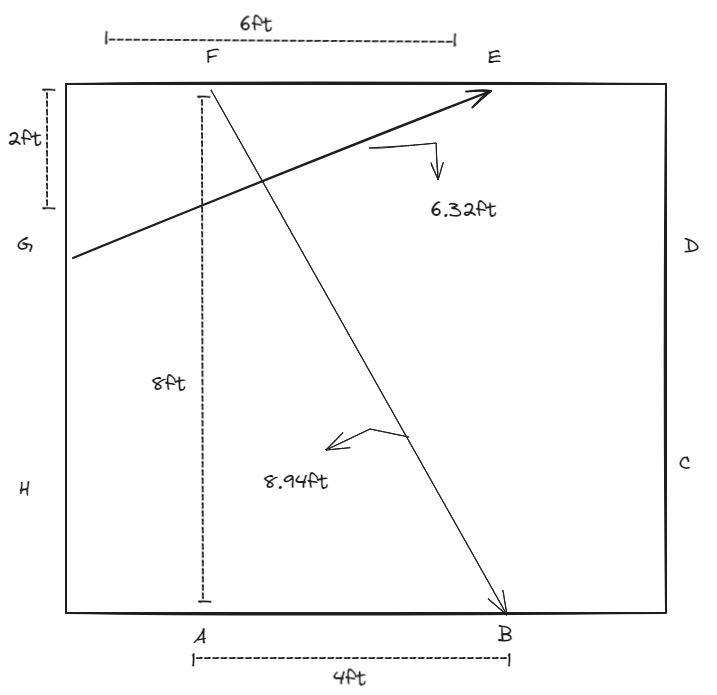
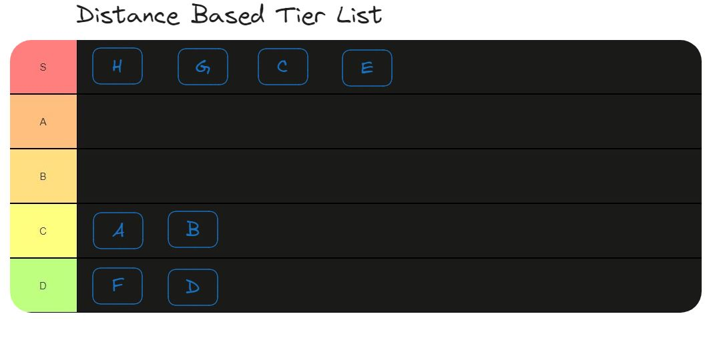

# Luck Based Start Positions

After comming to a good stopping point in reguards to the design of our robot for the 2024 IEEE Competition, I began optimizing our game strategy.

* How do we determin speed?
* What kind of CV is best to run?
* Where can we conserve our energy vs where should we sprint to the next station?

These questions lead me to quickly draw out the game field for a birds eye view in hopes that I could come up with a good strategy.

Here is the top down view of the field with the pre-determined path:

I know it may be alot to look at, but looking closley are you able to spot the unfair advantage?

> Hint: Look at G->E vs A->D

Heres an uncluttered view

Doing a bit of simple math we can find figure out the travel distance of each segment.

>G->E => √2²+6² ≈ 6.32ft
>
>A->D => √6²+6² ≈ 8.48ft

There is a clear advantage with starting positions G->E over A->D

It doesn't stop there either!

Check out Starting position F->B 

>F->B => √4²+8² ≈ 8.94ft

Here is a Tier List based on the initial travel distance of each Starting position

As you can see, if we are only allowed to charge at each station for maximum of 10 seconds, those who start at stations <strong>H, G, C, E</strong> have a clear advantage. 

Those in S tier charging stations only have to move 6.32 ft before another 10 seconds of charging while those in D tier must cover 9ft before charging for only 10 seconds.