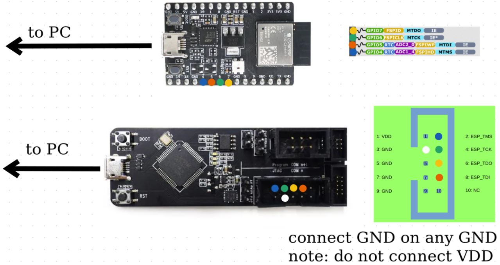
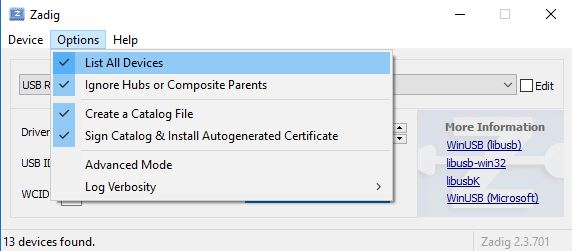
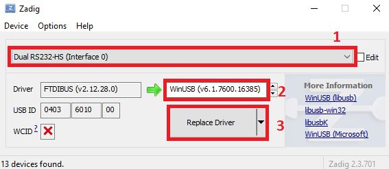
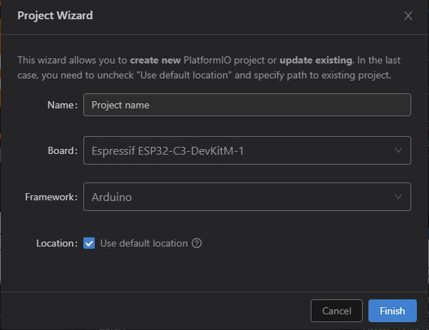

# How to setup JTAG Debugger in PIO with ESP32-C3

Instructions derived from [PlatformIO ESP-PROG docs](https://docs.platformio.org/en/stable/plus/debug-tools/esp-prog.html)

## Burning the efuse

### With pip (any platform)
#### Install esptools

```console
pip install esptools
```

```console
pip install setuptools
```

#### Burn the efuse
```console
python -m espefuse --port [your esp32 port] burn_efuse DIS_USB_JTAG 1 --do-not-confirm
```

### Ubuntu/Fedora Repos

#### Install esptools
```console
sudo [apt/dnf] install esptools
```
#### Burn the efuse
```console
espefuse --port [/dev/ttyUSBX] burn_efuse DIS_USB_JTAG 1 --do-not-confirm
```

## Hardware setup JTAG with ESP32-C3



> You will now use the port labeled USB on the ESP-32-C3 to upload files

## OS-Specific Driver Instructions

#### [Windows](#Windows-instructions)
#### [Linux](#Linux-instructions)
#### [macOS](#macOS-instructions)

### Windows instructions

#### Download FTDI drivers and Zadig

- [FTDI Drivers](http://www.ftdichip.com/Drivers/VCP.htm)
- [Zadig](https://zadig.akeo.ie/)

#### Launch Zadig

##### 1) List Devices


##### 2) Replace Drivers 


> Note: If zadig fails to replace drivers:
> 1. Restart your computer
> 2. delete the folder:   /Users/Your User/usb_drivers
> 3. Repeat steps 1 and 2 from the images above

### Linux instructions

#### Install udev rules
```console
curl -fsSL https://raw.githubusercontent.com/platformio/platformio-core/develop/platformio/assets/system/99-platformio-udev.rules | sudo tee /etc/udev/rules.d/99-platformio-udev.rules
```

#### Restart udev service
```console
sudo service udev restart
```
Alternatively, restart your machine

#### Add user to 'dialout' and 'plugdev' groups

##### Ubuntu and Fedora
```console
sudo usermod -a -G dialout $USER
```
##### Ubuntu only
```console
sudo usermod -a -G plugdev $USER
```

### macOS Instructions

#### Unload FTDI driver
```console
sudo kextunload /Library/Extensions/FTDIUSBSerialDriver.kext
```

## Create a new VS Code project 



## Config Platformio.ini file

```
[env:esp32-c3-devkitm-1]
platform = espressif32
board = esp32-c3-devkitm-1
framework = arduino

; esp-prog config
debug_tool = esp-prog
debug_speed = 500
debug_init_break = break setup

; uart config
upload_speed = 115200
monitor_speed = 115200

; optionally, specify the esp32's port
upload_port = [your esp32 port] 
```


Now you should be able to upload the project and start debugging :)